# TorqueMate

A data logger inspired by [TeslaMate](https://github.com/teslamate-org/teslamate), but was designed for any cars that provide data through OBDII and [Torque Android application](https://play.google.com/store/apps/details?id=org.prowl.torque).

## How it works?

```mermaid
flowchart LR
    car[🚗 Your car] <--> obd2[OBDII Reader] <-->|Bluetooth| torque[📱 Torque Android App]
    torque -->|HTTP| torquemate[TorqueMate]
    torquemate --> postgres[⛁ Postgres]
    grafana[Grafana] --> postgres
```



## Components

This project consists of two parts:

1. **Web server** written in C# using ASP.NET for receiving messages sent from Torque application and save to Postgres database.
2. **Grafana Dashboards** that you can import to your Grafana instance to visualize the data collected by the web server.

## Screenshots

### TorqueMate Basic


## Deployment

### Prerequisites

1. Docker
2. Postgres 16
3. Grafana 10

### 1. Setup Postgres instance

Create a new Postgres 16 instance, it could be on cloud or on your local server, and use [./migrations/bootstrap.sql](./migrations/bootstrap.sql) to automatically get the database schema ready.

### 2. Setup TorqueMate web server

Once you have your Postgres database, to start the web server, you'll need to provide the connection string to your database to the container environment variable.

```bash
docker run \
-p 5147:5147 \
-e ConnectionStrings__NpgsqlTorqueDatabase="Host=<YOUR_DATABASE_URL>; Port=5432; Database=<YOUR_DATABASE_NAME>; Username=<YOUR_DATABASE_USERNAME>; Password=<YOUR_DATABASE_PASSWORD>" \
ghcr.io/jeeyo/torquemate:latest
```

### 3. Setup Grafana

Create a new Grafana instance, setup a new data source to connect Grafana to your Postgres instance.

Then go to [https://<YOUR_GRAFANA_URL>/dashboards/import](), then import each dashboard JSON file in [grafana directory](./grafana).

### 4. Setup Torque Android Application

_TODO_

See [docker-compose.yml](./docker-compose.yml)
